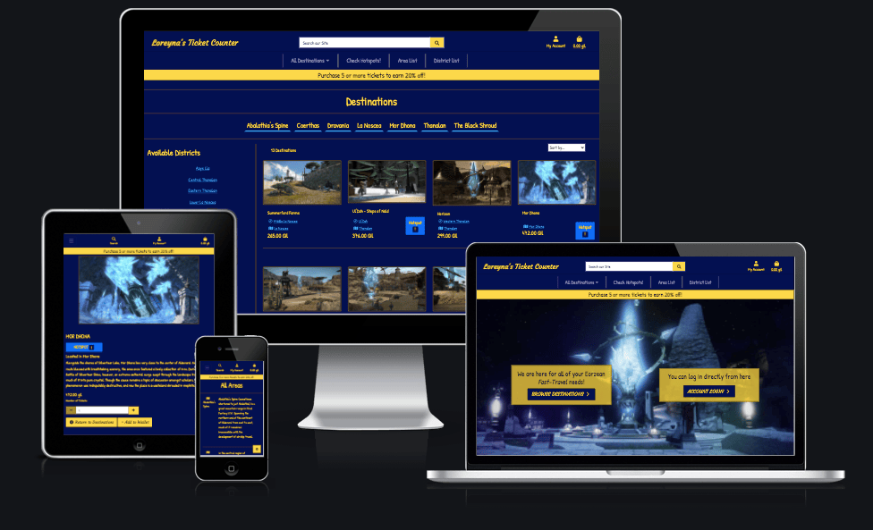

# Loreyna's Ticket Counter

## # Table of contents:

1. [Link To Live Site](#link-to-live-site)
2. [LucidChart ERD Diagram](#lucidchart-erd-diagram)
3. [Wireframes](#wireframes)
4. [Overview](#overview)
5. [User Stories](#user-stories)
6. [Features](#features)
    1. [Index Page](#index-page)
    2. [Destination Page](#index-page)
    3. [Areas Page](#index-page)
    4. [District Page](#index-page)
    5. [Add/Edit Pages](#index-page)
    6. [Delete Page](#index-page)
    7. [Destination Detail Page](#index-page)
    8. [Wallet Page](#index-page)
    9. [Checkout Page](#index-page)
    10. [Confirmation Page](#index-page)
    11. [Profile Page](#index-page)
7. [Features to Implement](#features-to-implement)
8. [Testing](#testing)
    1. [Lighthouse Reports](#lighthouse-reports)
    2. [HTML Testing](#html-testing)  
    3. [CSS Testing](#css-testing)
    4. [PEP8 Testing](#pep8-testing)
    5. [Automated Testing](#automated-testing)
    6. [Manual Testing](#manual-testing)
9. [Unfixed Bugs](#unfixed-bugs)
10. [Deployment](#deployment)
    1. [Forking and Cloning](#forking-and-cloning)
    2. [Local Deployment](#local-deployment)
    3. [Remote Deployment](#remote-deployment)
11. [Credits](#credits)

## Link to Live Site

https://loreynas-ticket-counter.herokuapp.com

## LudicChart ERD Diagram

[Loreyna's Ticket Counter ERD](media/readme-images/loreynas-counter-erd.png)

## Wireframes

In order to help me realise how i want to build the site, i have created a series of wireframes using Balsamiq:

[Index page](media/readme-images/index.png)

[Destinations](media/readme-images/destinations.png)

[Destination Details](media/readme-images/destination-details.png)

[Area List](media/readme-images/areas.png)

[District List](media/readme-images/districts.png)

[Add/Edit Entry](media/readme-images/addandedit.png)

[Delete](media/readme-images/delete.png)

[Wallet](media/readme-images/wallet.png)

[Checkout](media/readme-images/checkout.png)

[Confirmation](media/readme-images/confirmation.png)

[Profile](media/readme-images/profile.png)

## Overview

As a fan of the Final Fantasy franchise, I have enjoyed all aspects of the game and thought how interesting it would be the make a location site that people can browse and see the complete list of destinations for the 14th game in the series. As a fan of the game, I am forever trying to find the correct locations for travelling and this allows user to search for their destinations and admins to update Loreyna's Ticket Counter whenever new desitnations or locations are released.
The app for Loreyna's Ticket Counter is foremost an online ticket sales site that allows adventurers to book their travel destinations to anywhere on Eorzea. The tickets are a digital product and therefore have no delivery requirements, the products are redeemable from the aetheryte plaza to anywhere that also houses an aetheryte crystal.
The site offers a simple as well as helpful solution to navigate the wide world of Eorzea; locating where you would like to travel to and searching from a list of locations, with the feature to filter based on the main locations in the world and even the more specific districts within the locations. Each specific destination has a recogniseable image, a supporting description, there is even a badge that can be added to specific hotspots for people to see where is most popular.
The list of destinations will continue to increase while destinations are discovered and new Aetheryte crystals are installed, which means that the site owners will be able to update and keep materials fresh for the adventurers that want to travel to these destinations as and when they want.

## User Stories

kanban board with user stories broken up into sprints

## Features

I am a huge fan of the Final Fantasy gaming franchise and decided to adopt a similar style to Loreyna's Ticket Counter.

The color scheme I have chosen is the dark blue for a night feel and then a gold colour for the text; where the background has changed to gold I have inverted the colours so the text would be the dark blue. I have included some borders and section dividers for my site which are a darker gold colur; still standing out from the dark background but not drawing the attention away from the text and objects. When differentiation is needed from the normal dark blue or gold colours, I have included a lightblue contrasting colour that is similar to the design of the Aetheryte crystal in the image from the home page. The inspiration for the gold is taken from the gold band around the Aetheryte crystal and what all adventurers are really after besides glory - Gold.

### Main Nav Bar

I wanted to have a simple navigation that is clear to the users as to what each button means. The title of the site will be a simple gold Title linking back to the home page, a search bar that allows users to search for a destination term at any time, as well as a link to profile page or login in/out/sign up page and a link to the wallet so that users can see what they are currently going to be spending at any time. All text is written in gold and the title has a different font to make sure it stands out slightly more than the regular used text font.

### Index Page

The background image is an iconic Aetheryte Crystal which most users who visit the site woud recognise almost immediately. The image also sets up the color scheme for the rest of the site witht the dark blue main color, light blue and golds that stand out from the image.

[Index and nav bar](media/readme-images/ss-index.png)

### Destination Page

The destination page is a collection of card styled items that wil allow the user to gleam some simple information such as name and location details as well as price. The list at the top of the page below the header is all the current available list of areas that the admins have assigned, allowing the users to filter the list of destinations. We also have a list of districts on the left hand side which will also filter and reduce depending on the area chosen.

[Destination page](media/readme-images/ss-destinations.png)

### Areas Page

The area page is a simple page for listing the areas and a description for them so that users can decide if they want to go to these specific areas. The text is in gold to stand our from the background and there are simple links (if logged in as an admin) to allow admins to edit or delete the entry.

[Areas page](media/readme-images/ss-areas.png)

### Districts Page

The districts are also a simply displayed list of available districts for the areas that we have set up. These will be arranged as cards as they have very little information; we only need to know the Name of the district and the area that it is associated with. This will also have admin only edit | delete links. Main text written in gold and area text written in light blue.

[Districts page](media/readme-images/ss-districts.png)

### Add/Edit Page

The add and edit page will be identical in appearance as they both fulfill the same criteria; to post the details, whether new details or updating details. The forms themselves will have white backgrounds to help them stand out against the dark blue and muted grey text that disappears when there is text inputted. the buttons will align with the same style that the rest of the site has with gold background and dark blue text. a simple icon on each button to identify the action pairing with the text.

[Add/Edit page](media/readme-images/ss-add-edit.png)

### Delete Page

The delete page is a safeguard against accidental deletions; the page itself is a basic text driven page with request that the admin definitely wants to delete the specific entry. Main text is again written in gold and the wanring text is written in red to make sure the user is fully aware of the action. The name of the entry is written on the page as well so that the user knows what they are deleting with buttons to either cancel and go back or complete the deleting process in the same style of gold with dark bue text and icon.

[Delete page](media/readme-images/ss-delete.png)

### Destination Detail Page

The destiantion detail page is a much more in depth look at a specific destiantion; the larger image displaying on the page will give them user a view of the destiantion, with the details such as description and location in a more eloquent and visible style. There is also the links for admins to edit and delete this entry if need be, with simple quantity adjuster and gold buttons to keep the style in line with the rest of the site.

[Destination Details](media/readme-images/ss-destination-detail.png)

### Wallet Page

The wallet page has a list of destinations one on top of the other; images, names price, quantity and subtotal for how much each specific destination is going to cost. A the bottom fo the page we can see a total for the ticket wallet and if there are 5 or more tickets in the wallet then a discount of 20% is applied to the wallet and the savings are listed in light blue to draw attention away from the gold text. Two buttons for returning to the destinations page or heading to the checkout page in the same style as the other pages.

[Wallet page](media/readme-images/ss-wallet.png)

### Checkout Page

The checkout page is going to have a form on he left hand side of the page for inputting our name/email and location information as well as our stripe card details input. Gold buttons for completing purchase or adjusting the wallet before checking out again. On the right hand side there is a list of all the destination images, details and subtotal for that location. We can also the the total, discount and grand total for the wllet so the user has a clear idea of what they are paying for and how much it will be.

[Checkout page](media/readme-images/ss-checkout.png)

### Confirmation Page

The confirmation page is basic text, most text writen in gold but the specific details, such as the information we inputted into form is displayed in light blue. the display is broken down into three sections for orde details, personal details and order tickets; all in the same gold and lightblue pairing styles.

[Confirmation page](media/readme-images/ss-confirmation.png)

### Profile Page

Out profile page will consist of a form on the left hand side where a user can store information, either directly from the checkout page or manually add them so that they will display on new orders they place automatically if the user is signed in. on the right hand side we also have a list of previous orders so that the user can see what they have ordered in the past in case they want to go back to the same places again. the order history is written in a simple table that will scroll vertically through the list.

[Profile page](media/readme-images/ss-profile.png)

## Features to Implement

Hotspot Filtering

## Testing

### Lighthouse Reports

I have generated lighthouse reports for all my pages

### HTML Validation

HTML pages have been run through https://validator.w3.org/ and the pages have all come back without errors

### CSS Validation

I have passed through my css files into the https://jigsaw.w3.org/ checker and report no issues with my code.

### PEP8 Validation

### Manual Testing

### Automated Testing

## Bugs

secret key as exposed so a new secret key was generated

## Deployment

To deploy Loreyna's Ticket Counter, allow other people to run the app and see it working, there are 3 methods to allow you to complete these actions:

### Forking and Cloning

Accessing GitHub and navigating to my repositories will allow users to copy my code directly from the source, either by forking or cloning: Accessing the Loreyna's Ticket Counter repository and clicking on the code button next to Gitpod link will bring up a menu to create a repository of your own in your own GitHub repo. There is also the Download zip file option which will allow you to save a copy of my code as well.

### Local Deployment

For local deployment of Loreyna's Ticket Counter, I will be using Gitpod to edit and run my workspace;
- From GitHub, once the repository has been created (either as a new project or by forking/cloning) I will then click on the Gitpod button to implement the creation of a workspace to edit the promotional sales review system.

***The workspace should not be closed due to the env.py file; as it is never added to GitHub, if you create a new workspace you will need to re-add the env.py file and reinstall all libraries used each time. Pinning a workspace and accessing it from Gitpod workspaces will save time and repetition***

### Remote Deployment

For deployment of Loreyna's Ticket Counter, there are a number of steps required to complete this action;

- We are using the Site Heroku for our deployment;
    - In Heroku, create a new app and give it a name befitting your project.
    - In settings, we first need to make sure the config vars contain DEVELOPMENT with the value of False.
- We need to make sure a couple of our variable in our settings app are updated so that they are no longer developer enabled.
    - For our DEBUG setting;
            DEBUG = 'DEVELOPMENT' in os.environ
    - For our DATABASES variable;
            if 'DATABASE_URL' in os.environ:
                DATABASES = {
                    'default': dj_database_url.parse(os.environ.get('DATABASE_URL'))
                }
            else:
                DATABASES = {
                    'default': {
                        'ENGINE': 'django.db.backends.sqlite3',
                        'NAME': os.path.join(BASE_DIR, 'db.sqlite3'),
                    }
                }
    This is to ensure that the debug and database are using the correct variables so that when Loreyna's Ticket Counter is deployed, the users will be unable to see any of the secrets from the debug window and the correct database is being used.
- We need to set up our Stripe variables in settings and our Heroku dashboard in order to allow our deployed site to continue working.
    - Once you have logged in and set up our stripe endpoint using the code institute's walkthrough and cheat sheet, we can add the following variables to settings.py;

            STRIPE_CURRENCY = 'gbp'
            STRIPE_PUBLIC_KEY = os.getenv('STRIPE_PUBLIC_KEY', '')
            STRIPE_SECRET_KEY = os.getenv('STRIPE_SECRET_KEY', '')
            STRIPE_WH_SECRET = os.getenv('STRIPE_WH_SECRET', '')

    - In our dashboard settings for Gitpod, we need to add these in order for our environmental variables to work while in deployment.
        - Add the above variables to the env settings
        - For each variable, go to stripe and copy the secret codes
        - Add them to the relevant variables.
    
    - In Heroku, we need to include the last three as config vars in the settings page on the heroku dashboard.
- We will need to set up our resources so that the deployed project can work correctly;

        pip3 install gunicorn
        pip3 install dj_database_url
        pip3 install psycopg2-binary

        pip3 freeze > requirements.txt

- For our deployment, we will be using Heroku and we need to set up our database for the deployed version;
    - We need to add the Heroku Postgres resource from the Resources tab in the Heroku dashboard. This will assign us a variable which we will then need to add to our env.py file so that no one except ourselves can see it.
- For all of our deployed apps, we need to set up a Procfile to instruct Heroku how to handle the application;
    - In our Procfile, we need to add;

            web: gunicorn loreynas_counter.wsgi:application

- We need to add our AWS for media storage to the heroku variables as well;
    - First log in to AWS dashboard and set up your bucket using the code institute's walkthrough and cheat sheet.
    - You will end up producing an excel document that contains secret values that we need to use in Heroku in order to see our media.
    - Add the following KEY : Value variables to the Heroku Config Vars;

            AWS_ACCESS_KEY_ID : 'value'
            AWS_SECRET_ACCESS_KEY : 'value'
            USE_AWS : True

- For the emails and ability to send confirmations, we need to set up a few variables for the settings.py file and a couple in the heroku config variables.
    - In settings.py, add;

            if 'DEVELOPEMENT' in os.environ:
                EMAIL_BACKEND = 'django.core.mail.backends.console.EmailBackend'
                DEFAULT_FROM_EMAIL = 'loreynascounter@aetheryte.com'
            else:
                EMAIL_BACKEND = 'django.core.mail.backends.smtp.EmailBackend'
                EMAIL_USE_TLS = True
                EMAIL_PORT = 587
                EMAIL_HOST = 'smtp.gmail.com'
                EMAIL_HOST_USER = os.environ.get('EMAIL_HOST_USER')
                EMAIL_HOST_PASSWORD = os.environ.get('EMAIL_HOST_PASS')
                DEFAULT_FROM_EMAIL = os.environ.get('EMAIL_HOST_USER')
    
    - In Heroku config vars, add;

            EMAIL_HOST_PASS : 'leave blank for now'
            EMAIL_HOST_USER : 'your email address'

    ***It is best to use a gmail for this as our walkthrough from code institute gives clear instructions on how to set this up.***
    
    - In mail.google.com, go to the cog/settings for the account
    - Click Accounts and Imports tab
    - Click Other Google Account Settings
    - Head to security
    - Make sure 2-Step-Auth is turned on
    - Under this, click on App Passwords
    - Select Mail on first drop down
    - Select Other on second drop down and add text 'Django'
    - Once completed, you have generated a 16 digit code - Copy this
    - In Heroku dashboard config vars, add in;

            EMAIL_HOST_PASS : 'paste 16-digit code here'
    
    This will now allow our emails to correctly send from deployed site.

- Now we need to connect our Gitpod to Heroku

***Due to a serious Security breach, we are unable to link our gitpod to heroku using conventional means - this means we need to take an alternative approach; HEROKU CLI THROUGH GITPOD***

- To start the process, we need to sign in to Heroku CLI in the terminal;
        
        heroku login -i
    
- Sign in with your regular email account for heroku

- If you have an up-to-date account with Heroku, you will have switched on 2 step auth for your account, so you cannot sign in using you password; To get around this;
    - You can head to your account icon in Heroku dashboard
    - Select Account Settings
    - Scroll to bottom and reveal your API key
    - Copy this code and paste into your password field in terminal.
- You should now be connected to Heroku CLI which means we can now complete the Deployment procedure;
    - In terminal, type;

            heroku git:remote -a heroku-app-name

***This must contain the app name we have set up in heorku otherwise the app will not connect***

- As we have now linked up our new database to postgres, we need to migrate all our files to the new database;

        python3 manage.py migrate 

***You do not need to makemigrations first as we have already created them, we just need to move them to the correct place***
        
        git add .
        git commit -m "Complete deployment process to Heroku"
        git push
        git push heroku main

***By pushing to Heroku main, we are sending a copy for all of our code to Heroku to be deployed which means we can avoid the issue regarding the Security breach and not being able to connect for auto or manual deployments***

## Credits

- https://levelup.gitconnected.com/django-customize-404-error-page-72c6b6277317 - This page helped me to build a custom 404 html page in order to make the user experience much improved.
- All of the amazing team members working at the tutor team for the Code Institute, whom, without which, I would be a blubbering mess!
- My mentor Chris Quinn who has provided me with sound guidance and direction from the inception of Loreyna's Ticket Counter.
- All of the learning materials I have been studying provided by the Code Institute.
- Final fantasy images and names are used for educational purposes only and the information and images are taken from google searching of the specific destinations. This site is completely non profit and is not used for marketing of any kind.
